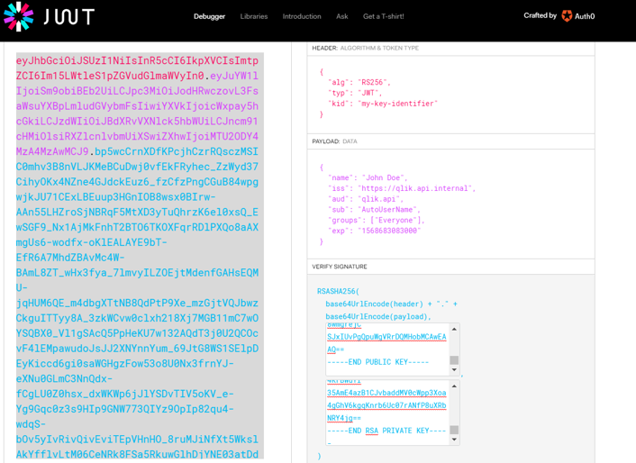

## Using JWT.IO
This is an alternative way to create a JWT token, but you have to copy/paste quite some information for each token.
 - Go to https://jwt.io
 - Paste this into the "HEADER" field: (make sure "kid" matches the kid setting in your helm qliksense .yaml)
```
{
  "alg": "RS256",
  "typ": "JWT",
  "kid": "my-key-identifier"
}
```
 - Paste this into the "PAYLOAD DATA" field:
```
{
  "iss": "https://qlik.api.internal",
  "aud": "qlik.api",
  "sub": "user@company.com",
  "groups": [
    "Everyone",
    "OtherGroup"
  ],
  "name": "FirstName LastName",
  "exp": 1800000000
} 
```
 - Paste the content of your pub.key into the first field of "VERIFY SIGNATURE"
 - Paste the content of your priv.key into the second field of "VERIFY SIGNATURE"
 
 
 
Now you can use the token to impersonate. <a href="using_token.md">Check out</a> how to use it.
